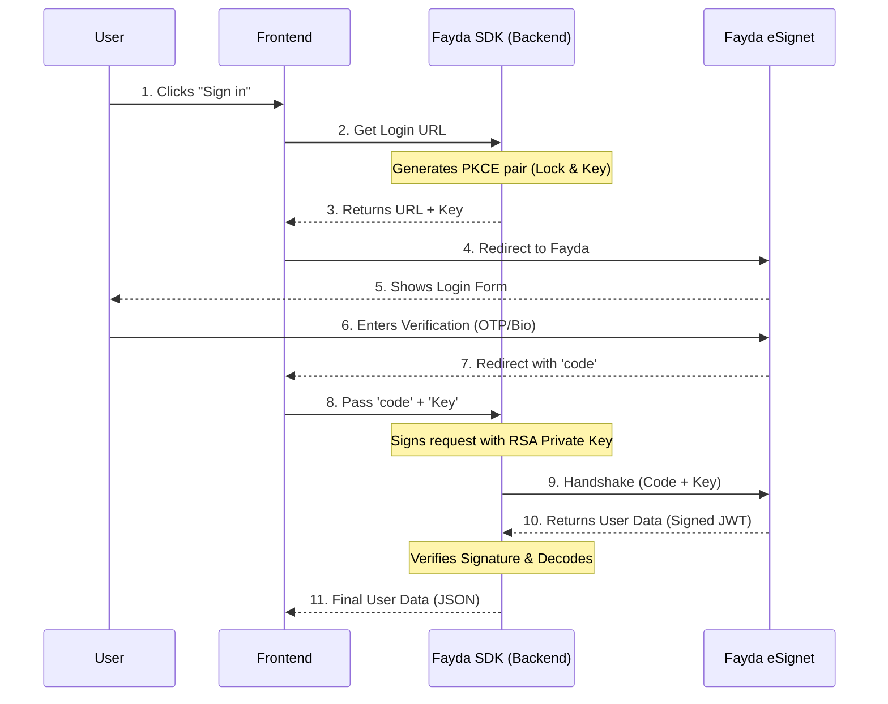

# Fayda SDK (Node.js)

[](https://www.npmjs.com/package/fayda-sdk)
[](https://opensource.org/licenses/ISC)

A minimalist, secure-by-default Node.js SDK for integrating with **Ethiopia's National ID (Fayda)** via the MOSIP eSignet OIDC platform.

This package handles the complexity of **OIDC**, **PKCE**, and **Private Key JWT** authentication, allowing you to focus on your application logic.

##  Features

-  **Zero-Config PKCE**: Automatically generates cryptographically secure `code_verifier` and `code_challenge`.
-  **Automated Signing**: Handles RSA-SHA256 signing of Client Assertions using your Private Key.
-  **Environment Presets**: Built-in configurations for `UAT` (Staging) and `PROD` (Live).
-  **Identity Unwrapping**: Automatically verifies and decodes the User Identity JWT returned by Fayda.
-  **TypeScript Support**: Includes full type definitions.

##  How It Works (The Flow)



##  Installation

```bash
npm install fayda-sdk
```

##  Usage

### 1. Initialize the Client

```javascript
import { FaydaClient } from 'fayda-sdk';

const fayda = new FaydaClient({
    clientId: 'your-client-id',
    privateKey: process.env.FAYDA_PRIVATE_KEY, // Base64 or PEM string
    environment: 'UAT', // Switch to 'PROD' for production
    redirectUri: 'http://localhost:3000/callback'
});
```

### 2. Generate Login URL (Frontend Step)

When the user clicks "Sign in with Fayda", generate the secure authorization URL.

```javascript
// Function in your backend controller
export function getLoginUrl(req, res) {
    // 1. Generate the URL and the PKCE "Key" (verifier)
    const { url, codeVerifier } = fayda.getAuthorizationUrl({
        scope: 'openid profile email phone' // Request permissions
    });

    // 2. CRITICAL: Save 'codeVerifier' in a secure cookie/session
    // You will need this to complete the login when they return!
    res.cookie('fayda_verifier', codeVerifier, { 
        httpOnly: true, 
        secure: true, 
        maxAge: 300000 // 5 mins 
    });
    
    // 3. Redirect user to Fayda
    res.redirect(url);
}
```

### 3. Handle Callback (Backend Step)

After the user authenticates, Fayda redirects them back to your `redirectUri` with a `code`.

```javascript
// Function in your callback controller
export async function handleCallback(req, res) {
    const { code } = req.query;
    
    // Retrieve the 'Key' we stored earlier
    const codeVerifier = req.cookies.fayda_verifier;

    if (!code || !codeVerifier) {
        return res.status(400).send("Login failed: Missing code or session expired.");
    }

    try {
        // The SDK performs the "Secret Handshake" (Exchange Code + Sign JWT)
        const user = await fayda.getUser(code, codeVerifier);

        console.log("Verified User:", user);
        // Output: { name: "Abebe", phone_number: "+2519...", gender: "Male", ... }

        res.json({ success: true, user });

    } catch (error) {
        console.error("Login Failed:", error.message);
        res.status(401).send("Authentication Failed");
    }
}
```

##  Key Generation

To use this SDK, you need an RSA Key Pair registered with the National ID Program.

### Generating Keys (OpenSSL)

```bash
# 1. Generate Private Key
openssl genrsa -out private_key.pem 2048

# 2. Extract Public Key (Share this with NID)
openssl rsa -in private_key.pem -pubout -out public_key.pem
```

### Encoding for .env
We recommend Base64 encoding your private key to keep it on one line in your `.env` file.

**Mac/Linux:**
```bash
base64 -w 0 private_key.pem
```

**Windows (PowerShell):**
```powershell
[Convert]::ToBase64String([IO.File]::ReadAllBytes("private_key.pem"))
```

Then in `.env`:
```env
FAYDA_PRIVATE_KEY="LS0tLS1CRUdJTiBQUk..."
```

See [docs/KEY_GENERATION.md](https://github.com/melaku-tilahun/fayda-sdk/blob/main/docs/KEY_GENERATION.md) for more details.

##  Contributing

Repository: [https://github.com/melaku-tilahun/fayda-sdk](https://github.com/melaku-tilahun/fayda-sdk)

1. Fork the repo
2. Create your feature branch (`git checkout -b feature/amazing-feature`)
3. Commit your changes (`git commit -m 'Add some amazing feature'`)
4. Push to the branch (`git push origin feature/amazing-feature`)
5. Open a Pull Request

##  License

Distributed under the ISC License. See `LICENSE` for more information.
